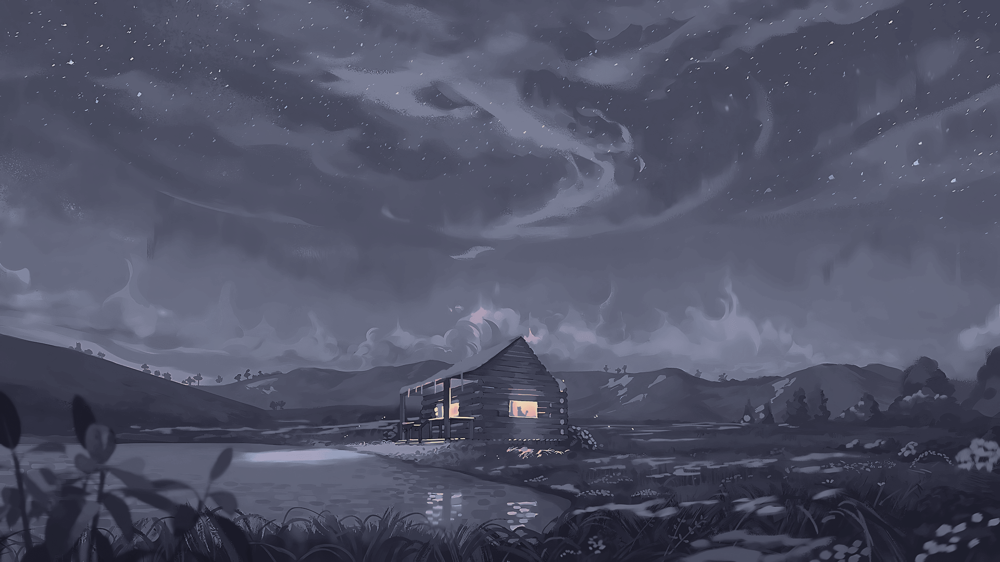
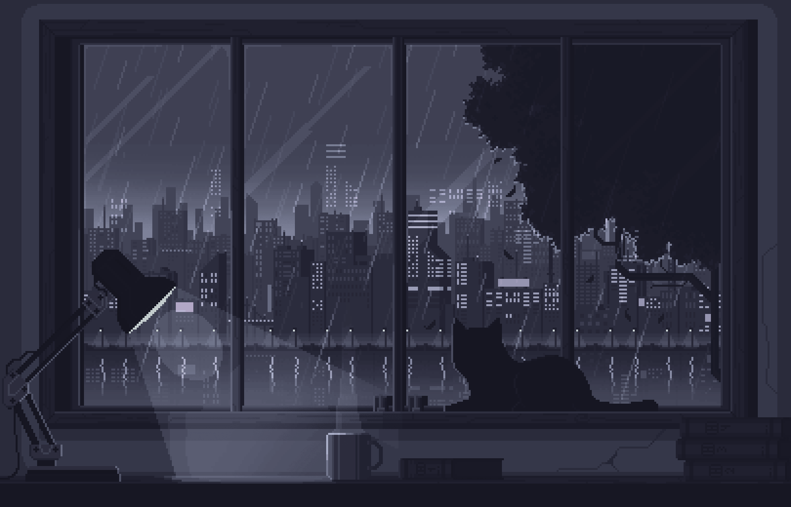

This is a hobbyist project made by me. I made this repository to backup my configuration rice files and to share them with my friends. If you want to use these, follow the installation instructions below:


## Installation

First, clone the repository:

```bash
git clone https://github.com/OrderTheCat/Simple-Rice.git
```

Second, go into the repository:

```bash
cd Simple-Rice
```

Third, run the **install.sh** script:

```bash
bash install.sh
```

**or**

```bash
sh install.sh
```

## Manual Installation

If you don't want to use the script and install the rice manually, follow these steps:


```

Move configuration files:

**fastfetch:**

```bash
mv /path/to/rice/folder/fastfetch/asciiart.txt ~/.config/fastfetch
mv /path/to/rice/folder/fastfetch/config.jsonc ~/.config/fastfetch
```

**icons:**

```bash
mv /path/to/rice/folder/icons/Catppuccin-Mocha ~/.local/share/icons
```

**kitty:**

```bash
mv /path/to/rice/folder/kitty/kitty.conf ~/.config/kitty
```

**shell:**

```bash
mv /path/to/rice/folder/shell/config.fish ~/.config/fish
```

```bash
mv /path/to/rice/folder/shell/starship.toml ~/.config
```

## Icon Theme

Flat Remix Violet Dark.
  - Can be found in the kde plasma themes store.


## Cursor Theme

Adwaita defautl GNOME cursor.
  - Can be found in this github repository:
    - https://github.com/manu-mannattil/adwaita-cursors

## Fonts

(Iosevka Nerd Font)

Arch:

```bash
sudo pacman -S ttf-iosevka-nerd
```

```bash
fc-cache -fv
```

Debian:

```bash
wget -P ~/.local/share/fonts https://github.com/ryanoasis/nerd-fonts/releases/download/v3.0.2/Iosevka.zip && cd ~/.local/share/fonts && unzip Iosevka.zip && rm Iosevka.zip && fc-cache -fv
```

Fedora:

```bash
sudo dnf copr enable nerd-fonts/nerd-fonts
```

```bash
sudo dnf install nerd-fonts-iosevka
```

```bash
fc-cache -fv
```


I'm sure you can set the wallpapers by yourself :D


## Wallpapers Preview

**Source**: https://github.com/orangci/walls-catppuccin-mocha/tree/master

***cabin-3***

  


***cabin-4***

 


***cabin***

 


***call-it-a-day***


***cat-vibin***




***cottages-river***

 

